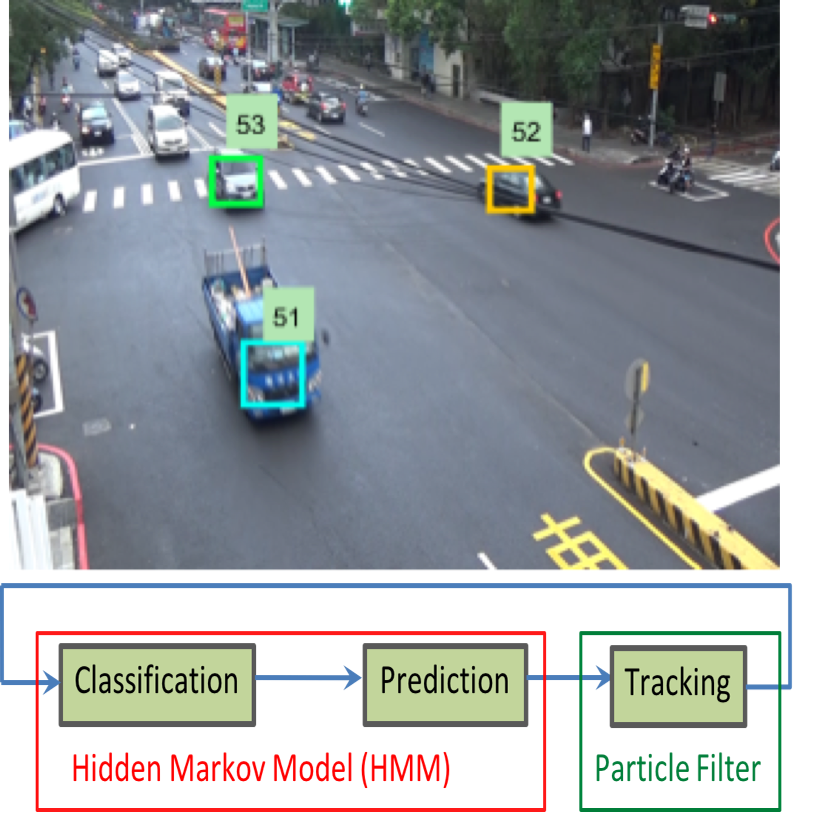

I currently work with Prof.  [Chu-Song Chen](http://www.iis.sinica.edu.tw/pages/song/eindex.html)  in  [Institute of Information Science, Academia Sinica](https://www.iis.sinica.edu.tw/index_en.html). I have broad interests in Computer Vision and Deep Learning. In particular, I am interested in computational efficiency of neural networks for multiple tasks. More details, please see my CV.  <b>I am looking for a Ph.D. position start from 2019 Fall or any research internship start from 2019 Winter/Spring.</b> 
[[CV]](https://cewu.github.io/files/CHENG_EN_WU_s_CV.pdf)&ensp;(last updated: Dec. 2018)

---
# Publications

&ensp;&nbsp;&nbsp;<b>Traffic pattern modeling, trajectory classification and vehiclet &ensp;&nbsp;&nbsp;tracking within urban intersections</b> 
&ensp;&nbsp;&nbsp;<b>Cheng-En Wu</b>, Wen-Yen Yang, Hai-Che Ting, Jia-Shung Wang 
&ensp;&nbsp;&nbsp;International Smart Cities Conference (ISC2), 2017 [[PDF]](https://cewu.github.io/files/Vehicle_tracking_ICS2_2017.pdf)

---

# Work Experience
 
 &ensp;&nbsp;&nbsp;<b>Academia Sinica</b> 
 &ensp;&nbsp;&nbsp;Research Assistant 
 &ensp;&nbsp;&nbsp;Mar. 2018 - Present   
 
 &ensp;&nbsp;&nbsp;<b>MediaTek Inc.</b> 
 &ensp;&nbsp;&nbsp;Software Engineer 
 &ensp;&nbsp;&nbsp;Mar. 2017 - Mar. 2018   
 
 &ensp;&nbsp;&nbsp;<b>Realtek Inc.</b> 
 &ensp;&nbsp;&nbsp;Software Engineer 
 &ensp;&nbsp;&nbsp;Dec. 2016 - Mar. 2017   
 
 &ensp;&nbsp;&nbsp;<b>GOTrust Technology Inc.</b> 
 &ensp;&nbsp;&nbsp;Software Engineer 
 &ensp;&nbsp;&nbsp;Jan. 2014 - Jun. 2014   
 
---
# Education
 
&ensp;&nbsp;&nbsp;<b>National Tsing Hua University</b> 
&ensp;&nbsp;&nbsp;M.S. in Computer Science 
&ensp;&nbsp;&nbsp;Sep. 2014 - Jul. 2016   
 
&ensp;&nbsp;&nbsp;<b>National Taiwan University of Science and Technology</b> 
&ensp;&nbsp;&nbsp;B.S. in Electrical and Computer Engineering 
&ensp;&nbsp;&nbsp;Sep. 2009 - Jun. 2012  
